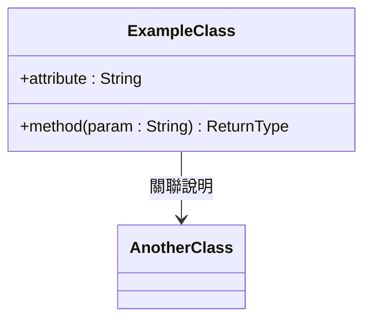

# Create Class Diagram from Sequence Diagram

## 目標

從 Mermaid Sequence Diagram 中萃取所有 **Domain Object**，依照 OMG UML 2.x 標準，以 Mermaid `classDiagram` 語法設計完整的 Class Diagram，並將結果直接寫入對應的檔案中。

---

## When to Use

- 使用者要求從 Sequence Diagram 產生 Class Diagram
- 使用者要求找出 Domain Object 並建立 Class 模型
- 使用者提到 「Class Diagram」、「類別圖」、「領域物件」、「Domain Object」、「UML Class」
- 在完成 Sequence Diagram 設計之後，進行下一階段的物件導向建模

---

## Procedure

### Step 1 — 讀取 Sequence Diagram 檔案

1. 若使用者有指定檔案，讀取該檔案。
2. 若未指定，搜尋工作區中所有以 `SD_` 開頭的 `.md` 檔案，逐一讀取。
3. 解析每一個 `sequenceDiagram` 區塊的內容。

### Step 2 — 識別 Domain Object

從 Sequence Diagram 中依以下規則萃取 Domain Object：

- **納入**：所有 `participant` 宣告的元素（系統、服務、實體物件）
- **排除**：所有 `actor` 宣告的元素（人物角色不作為 Domain Class）
- 記錄每個 Domain Object 的**英文名稱**（即 participant 名稱或其別名前的原始名稱）

### Step 3 — 萃取屬性（Attributes）

逐行分析每個 message（`->>` 與 `-->>`）中傳遞的參數，依以下規則推斷各 Class 的屬性：

| 分析對象 | 規則 |
|----------|------|
| 接收方法的輸入參數 | 視為該 Class 持有的屬性候選（如 `registerAccount(username, password, email)` → Account 有 username, password, email） |
| 回傳值 | 視為該 Class 的輸出屬性或計算結果（如 `-->> RentalFee: totalFee` → RentalFee 有 totalFee） |
| Note 中的中文說明 | 輔助判斷屬性語意，不作為屬性名稱 |

屬性命名規則：
- 名稱使用 **camelCase** 英文
- 型別依語意推斷：`String`、`Int`、`Float`、`Date`、`Boolean`、或其他 Domain Class 名稱
- 存取修飾子依 UML 預設使用 `+`（public）

### Step 4 — 萃取方法（Methods）

從 message 中分析各 Class 所**接收**的呼叫，作為該 Class 的方法：

- 同步呼叫（`->>`）所對應的目標 participant 擁有該方法
- 方法簽名保留原始 message 名稱（PascalCase 或 camelCase 皆可保留）
- 回傳值型別從對應的回傳 message（`-->>`）推斷

### Step 5 — 識別類別關係（Relationships）

依照 OMG UML 標準，從 message 流程分析類別間的關係：

| 關係類型 | Mermaid 語法 | 判斷條件 |
|----------|-------------|----------|
| Association（關聯） | `ClassA --> ClassB` | A 持有 B 的屬性或參數 |
| Dependency（依賴） | `ClassA ..> ClassB` | A 呼叫 B 的方法，但不持有 B |
| Aggregation（聚合） | `ClassA o-- ClassB` | A 包含多個 B 實例 |
| Composition（組合） | `ClassA *-- ClassB` | B 的生命週期由 A 控制 |
| Realization（實現） | `ClassA ..|> InterfaceB` | A 實作介面 B |

分析方式：
- 若 Class A 的方法接受 Class B 作為參數 → `A ..> B`（Dependency）
- 若 Class A 的屬性型別為 Class B → `A --> B`（Association）
- 若 A 建立並管理 B 的生命週期 → `A *-- B`（Composition）

### Step 6 — 撰寫 Mermaid Class Diagram

依照以下格式與規範撰寫：

```
classDiagram
    class ClassName {
        +attributeName : Type
        +methodName(param : Type) ReturnType
    }

    ClassA --> ClassB : relationship label（中文說明）
    ClassA ..> ClassC : uses
```

**命名與格式規範：**
- Class 名稱使用 **PascalCase** 英文（與 Sequence Diagram participant 名稱一致）
- 屬性與方法名稱使用 **camelCase** 英文
- 每個 Class 至少包含 1 個屬性與 1 個方法
- Relationship label 使用**中文**說明關聯語意（符合專案中文註解風格）
- 遵循 OMG UML 2.x Class Diagram 符號定義

### Step 7 — 寫入檔案

1. 判斷輸出檔案位置：
   - 若分析的是 `SD_01_xxx.md`，輸出至同目錄下新建或更新 `CD_01_xxx.md`
   - 若使用者指定輸出檔案，寫入該檔案
2. 以 Markdown 格式輸出，Mermaid 語法使用 ` ```mermaid ` 包裹
3. 在圖形下方加上 **補充說明表格**，列出每個 Class 的中文名稱與職責說明

---

## Output Format

每個輸出檔案的結構如下：

```markdown
# CD_XX 車輛租用 — Class Diagram



---

## 補充說明

| Class 名稱 | 中文名稱 | 職責說明 |
|------------|----------|----------|
| ExampleClass | 範例類別 | 負責... |
```

---

## UML Rules Reference（OMG UML 2.x）

- **屬性格式**：`visibility name : Type [multiplicity]`
- **方法格式**：`visibility name(parameters) : ReturnType`
- **Visibility**：`+` public、`-` private、`#` protected、`~` package
- **Actor 不建模為 Class**：Sequence Diagram 中的 `actor` 代表外部使用者，不納入 Class Diagram
- **System/Service participant** 可建模為 `class`（控制類別 Control Class）或 `interface`
- **Entity participant**（如 Account、RentalOrder）建模為 Entity Class
