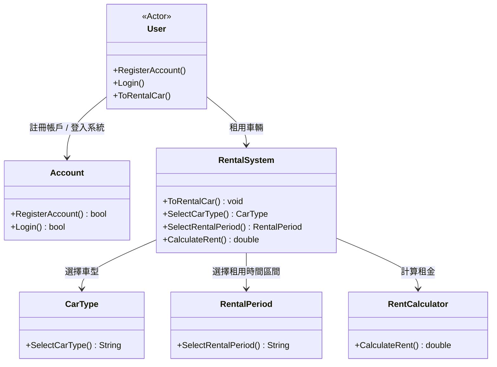

# CD_01 車輛租用系統 - Class Diagram

## 系統說明
此類別圖是根據 SD_01 車輛租用系統的序列圖所轉換而來，描述租車系統中各類別之間的關係與職責。

## Class Diagram

```mermaid
classDiagram
    class User {
        <<Actor>>
        +RegisterAccount()
        +Login()
        +ToRentalCar()
    }

    class Account {
        +RegisterAccount() bool
        +Login() bool
    }

    class RentalSystem {
        +ToRentalCar() void
        +SelectCarType() CarType
        +SelectRentalPeriod() RentalPeriod
        +CalculateRent() double
    }

    class CarType {
        +SelectCarType() String
    }

    class RentalPeriod {
        +SelectRentalPeriod() String
    }

    class RentCalculator {
        +CalculateRent() double
    }

    User --> Account : 註冊帳戶 / 登入系統
    User --> RentalSystem : 租用車輛
    RentalSystem --> CarType : 選擇車型
    RentalSystem --> RentalPeriod : 選擇租用時間區間
    RentalSystem --> RentCalculator : 計算租金
```

