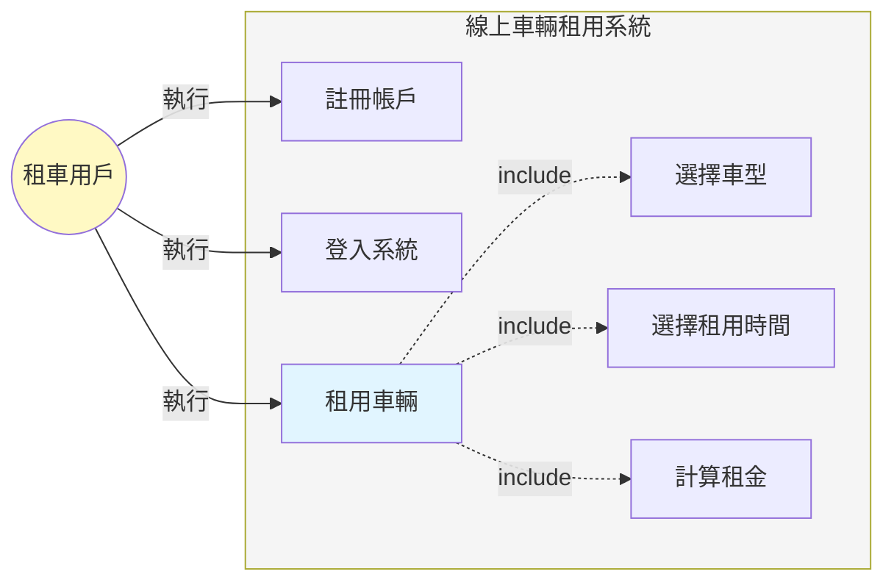

# UC_01 車輛租用系統 - Use Case Diagram

## 系統說明
這是一個提供租車用戶可在線上預先租用車輛的系統。租車用戶必須先註冊帳戶並登入後才可預先租用車輛。在租用車輛時，可以選擇車型、租用時間區間、並計算租金。

## Use Case Diagram

```mermaid
flowchart LR
    subgraph System["線上車輛租用系統"]
        UC1[註冊帳戶]
        UC2[登入系統]
        UC3[租用車輛]
        UC4[選擇車型]
        UC5[選擇租用時間]
        UC6[計算租金]
    end
    
    User((租車用戶))
    
    User -->|執行| UC1
    User -->|執行| UC2
    User -->|執行| UC3
    
    UC3 -.->|include| UC4
    UC3 -.->|include| UC5
    UC3 -.->|include| UC6
    
    style UC3 fill:#e1f5ff
    style User fill:#fff9c4
    style System fill:#f5f5f5
```
