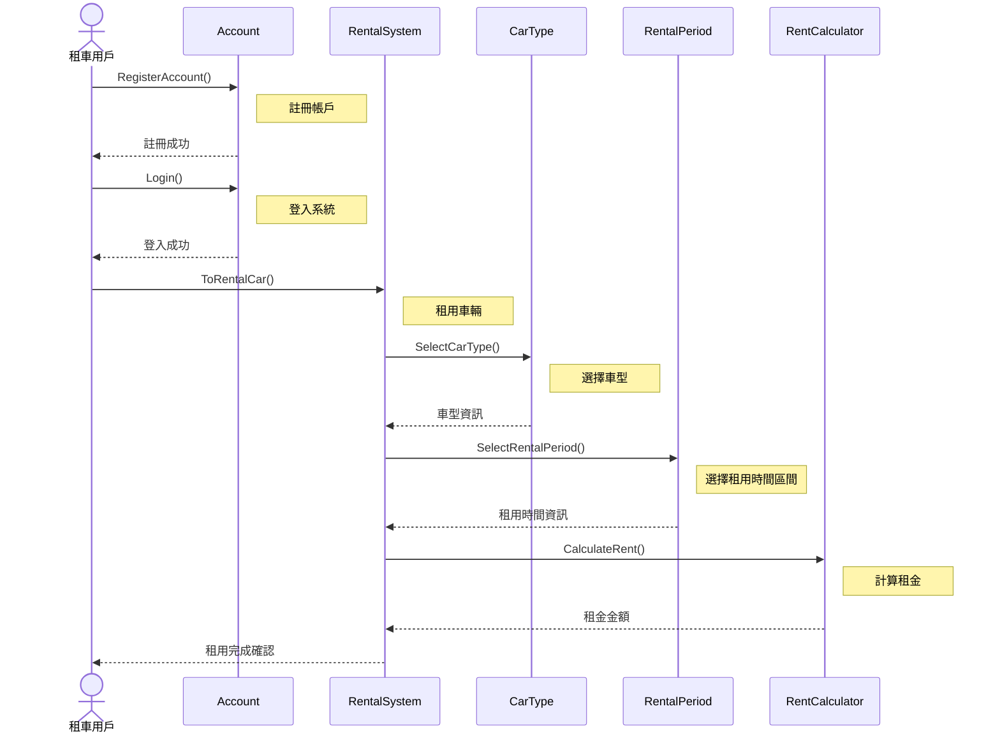

# SD_01 車輛租用系統 - Sequence Diagram

## 系統說明
這是一個展示租車用戶進行線上租車流程的序列圖。用戶需要先註冊帳戶、登入系統後，才能進行車輛租用。租用車輛的過程包含選擇車型、選擇租用時間區間，以及計算租金。

## Sequence Diagram

```mermaid
sequenceDiagram
    actor User as 租車用戶
    participant Account as Account
    participant RentalSystem as RentalSystem
    participant CarType as CarType
    participant RentalPeriod as RentalPeriod
    participant RentCalculator as RentCalculator
    
    User->>Account: RegisterAccount()
    Note right of Account: 註冊帳戶
    Account-->>User: 註冊成功
    
    User->>Account: Login()
    Note right of Account: 登入系統
    Account-->>User: 登入成功
    
    User->>RentalSystem: ToRentalCar()
    Note right of RentalSystem: 租用車輛
    
    RentalSystem->>CarType: SelectCarType()
    Note right of CarType: 選擇車型
    CarType-->>RentalSystem: 車型資訊
    
    RentalSystem->>RentalPeriod: SelectRentalPeriod()
    Note right of RentalPeriod: 選擇租用時間區間
    RentalPeriod-->>RentalSystem: 租用時間資訊
    
    RentalSystem->>RentCalculator: CalculateRent()
    Note right of RentCalculator: 計算租金
    RentCalculator-->>RentalSystem: 租金金額
    
    RentalSystem-->>User: 租用完成確認
```
