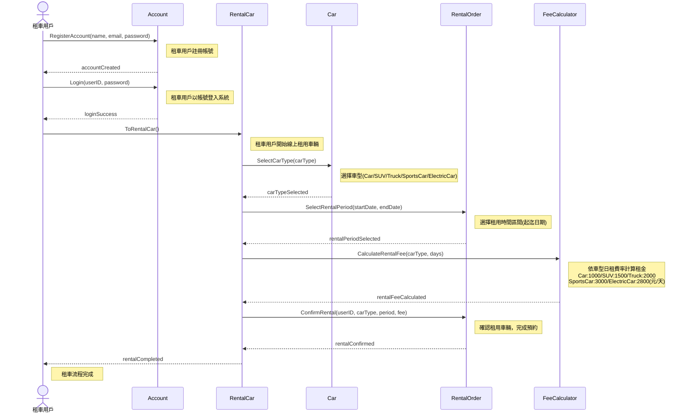

# SD_01 車輛租用系統 - Sequence Diagram

---

## Sequence Diagram 說明

### 參與者 (Participants)

| 參與者 | 說明 |
|--------|------|
| 租車用戶 (User) | 使用本系統進行線上預先租用車輛的使用者 |
| Account | 負責帳號註冊與登入驗證的領域物件 |
| RentalCar | 負責協調整體租車流程的領域物件 |
| Car | 負責車型資訊與選擇的領域物件 |
| RentalOrder | 負責租用時間選擇與訂單確認的領域物件 |
| FeeCalculator | 負責依車型與天數計算租金的領域物件 |

### 訊息流說明

| 訊息 | 說明 |
|------|------|
| `RegisterAccount(name, email, password)` | 租車用戶向 Account 註冊帳號 |
| `Login(userID, password)` | 租車用戶以帳號密碼登入系統 |
| `ToRentalCar()` | 租車用戶發起線上租車請求 |
| `SelectCarType(carType)` | 選擇車型：Car / SUV / Truck / SportsCar / ElectricCar |
| `SelectRentalPeriod(startDate, endDate)` | 選擇租用起迄日期 |
| `CalculateRentalFee(carType, days)` | 依車型日租費率與天數計算總租金 |
| `ConfirmRental(userID, carType, period, fee)` | 確認租用資訊，完成預約 |
