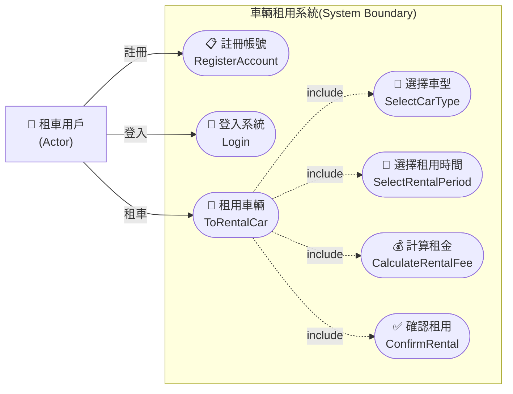

# UC_01 車輛租用系統 - Use Case Diagram

---

## Use Case 說明

| Use Case | 說明 | 備註 |
|----------|------|------|
| 📋 註冊帳號 (RegisterAccount) | 租車用戶在租用車輛前，必須先註冊帳戶資料 | 前置條件 |
| 🔑 登入系統 (Login) | 租車用戶以註冊帳號登入系統後，才可進行租車操作 | 前置條件 |
| 🚗 租用車輛 (ToRentalCar) | 主要事件流，租車用戶可線上預先租用車輛 | 主要 Use Case |
| 🚙 選擇車型 (SelectCarType) | 租車用戶可選擇車型：轎車 Car、休旅車 SUV、貨車 Truck、跑車 SportsCar、電動車 ElectricCar | include |
| 📅 選擇租用時間 (SelectRentalPeriod) | 租車用戶選擇租用的時間區間（起迄日期） | include |
| 💰 計算租金 (CalculateRentalFee) | 依車型日租費率計算租金：Car 1000元/天、SUV 1500元/天、Truck 2000元/天、SportsCar 3000元/天、ElectricCar 2800元/天 | include |
| ✅ 確認租用 (ConfirmRental) | 租車用戶確認租用車輛，完成預約 | include |

### Actor 說明

| Actor | 說明 |
|-------|------|
| 🧑 租車用戶 | 使用本系統進行線上預先租用車輛的使用者 |

### 事件流說明

- **主要事件流**：租車用戶 → 租用車輛 (ToRentalCar)
  - 包含 (include)：選擇車型 → 選擇租用時間 → 計算租金 → 確認租用
- **前置條件**：租車用戶必須先完成「註冊帳號」並「登入系統」後，才能進行租用車輛操作
